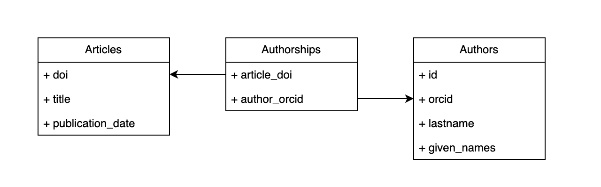

# Annotating the dynamic: Type Annotation for DataFrames

This repository contains the code and data for the EuroSciPy 2025 tutorial "Annotating the dynamic: Type Annotation for DataFrames".

The tutorial will demonstrate, using type annotations can greatly improve the readability and maintainability of your code, especially when working with complex data structures like DataFrames.
As one benefit of type annotations are improved code suggestions,
it's recommended to join the tutorial with an IDE, such as Visual Studio Code or PyCharm.

## Setup

### UV (recommended)

You need to have git and uv already installed on your system.

```bash
git clone https://github.com/MDPI-AG/euroscipy2025.git type-annotation
cd type-annotation
uv sync
```

### With pip and a virtual env

If you prefer to use pip, you can install the required packages using the following command. We recommend to use a virtual environment.

```bash
git clone https://github.com/MDPI-AG/euroscipy2025.git type-annotation
cd type-annotation
python -m venv .venv
source .venv/bin/activate
pip install -r requirements.txt
```

### Binder

In case you don't want to install any dependency locally, you can participate with your browser using Binder. 

[](https://mybinder.org/v2/gh/MDPI-AG/euroscipy2025/HEAD?urlpath=%2Fdoc%2Ftree%2Ffamiliarize_plainpython.ipynb)

However, the Binder environment will does not provide a Language Server IDE, so code suggestions will not work for you.

## Dataset

The dataset consists of two entities: Scientific publications (aka **Articles**) and their **Authors**. The dataset is build using all publications from MDPI's Plant journal and their authors. The many-to-many relationship is between Authors and Articles is modelled with a product entities: **Authorship**.



Articles have the following attributes:
  * **title:** The title of the publication.
  * **publication_date:** The date when the open-access publication was first published on mdpi.com.
  * **doi:** The Digital Object Identifier of the publication. The DOI uniquely identifies every scientific publication. 

Authors have the following attributes:
  * **id:** A unique and sequential identifier used as row and column indices to build a 2d co-authorship matrix. The matrix is needed as input to Dijkstra's shortest path algorithm.
  * **lastname:** The lastname of the author.
  * **given_names:** All given names of the author, separated by spaces.
  * **orcid:** A unique identifier, intended to uniquely identify scholars and their publication list.

## Score card

During the tutorial, you will explore the effect of different approaches on type annotation. To compare different methods,
we will use the following score card.

| | Live suggestion: Method | Live suggestion: Key/Column | Live suggestion: Item/Column type | Reporting: Non-existent Item/Column | Reporting: Non-existent/Column (mypy) | Reporting: Argument mistake | Reporting: Argument mistake (mypy) | Data Validation | 
|----------|-------------|------------------|-------------|------------|------------------|------------------|------------------|------------------|
| Plain Python | | | | | | | | | 
| TypedDict  | | | | | | | | |
| Pydantic  | | | | | | | | |
| DataFrame | | | | | | | | |
| DataFrame + Schema | | | | | | | | |


## Note
Copyright (C) 2025 MDPI AG

This program is free software: you can redistribute it and/or modify
it under the terms of the GNU General Public License as published by
the Free Software Foundation, version 3 of the License.

This program is distributed in the hope that it will be useful,
but WITHOUT ANY WARRANTY; without even the implied warranty of
MERCHANTABILITY or FITNESS FOR A PARTICULAR PURPOSE.  See the
GNU General Public License for more details.

You should have received a copy of the GNU General Public License
along with this program.  If not, see <https://www.gnu.org/licenses/>.


The dataset provided with this repository is for educational purposes at EuroSciPy 2025 in Krakow. Any other use of the data is prohibited.